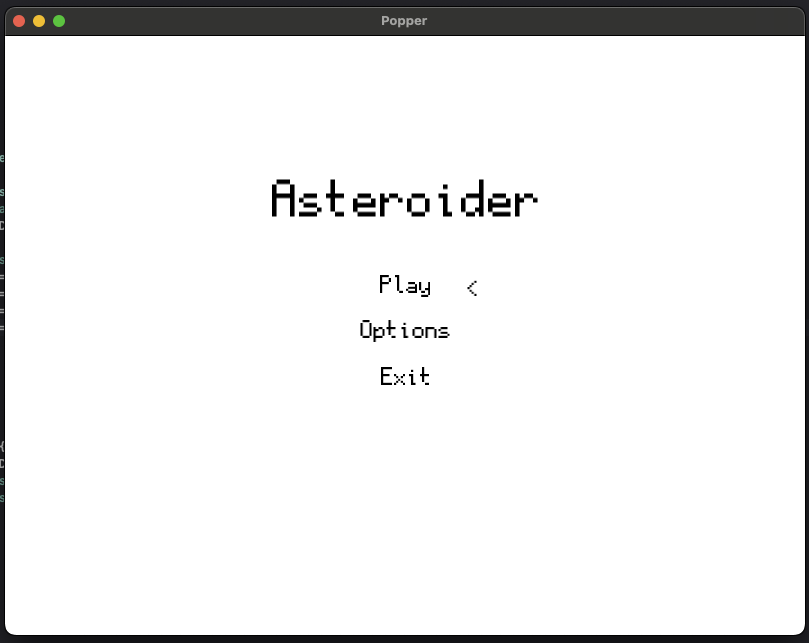

# Asteroid Adventure

A simple game built using C++ & SFML as a learning project.

## Development state:

The project is in active development.

- [x] Implement main menu
- [x] Implement game loop
- [x] Implement shooting
- [x] Implement game ending collisions
- [x] Implement high score
- [x] Implement options
- [x] Improve resource handling
- [ ] Implement difficulty improvements (asteroids should have variable speed)
- [ ] Look into setting up a compiler toolchain outside of Xcode
- [ ] Implement persistent game state (resume game / start new)
- [ ] Improve graphical fidelity

## Screenshots

